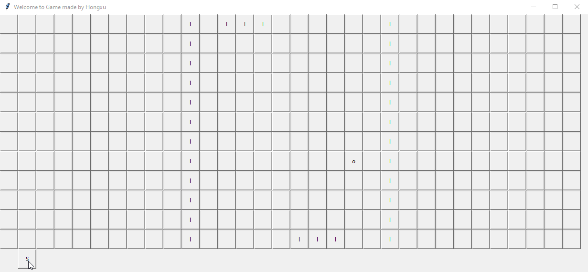

# Multiagent_RL_model
 > Create a game agent with Reinforcement Learning  & multiagent model

## Table of contents
* [General info](#general-info)
* [Demo](#demo)
* [Technologies](#technologies)
* [Setup](#setup)
* [Features](#features)
* [Status](#status)
* [Inspiration](#inspiration)
* [Contact](#contact)

## General info
My insterest is in Reinforcement learning and multi-agent system, using project like this to practice and gain experience. (2 VS 2)

## Demo

## Technologies
* Python 3 - pytorch
* Python 3 - tkinter